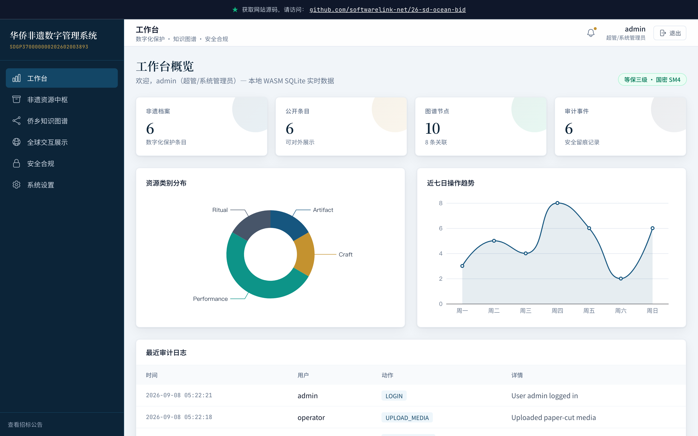

# 华侨非物质文化遗产数字管理系统 

> **上线主域名**: https://26-sd-ocean-bid.softwarelink.net/
> **项目仓库**: https://github.com/softwarelink-net/26-sd-ocean-bid



## 📖 项目简介
本项目为中共山东省委统战部融媒体中心委托开发的“华侨非物质文化遗产数字管理系统”技术演示。系统旨在利用数字化手段，对海外华侨非物质文化遗产进行采集、管理、保护与传播，满足政府采购中的软件开发、等保密评及监理要求。

## 🚀 部署与运行说明

### 环境要求
- **Node.js**: >= 18.0.0
- **pnpm**: >= 8.0.0 (或 npm/yarn)
- **内存**: >= 4GB RAM

### 依赖安装
```bash
# 安装依赖
pnpm install
# 或使用 npm
npm install
```

### 本地运行
本项目为纯前端演示系统，基于 Vue 3 + Vite + Tailwind CSS 构建，数据模拟存储于浏览器端 IndexedDB (via sql.js) 或本地 JSON 模拟。

```bash
# 启动开发服务器
pnpm run dev
# 访问: http://localhost:5173
```

### 构建生产版本
```bash
pnpm run build
# 产物输出至 dist/ 目录，可直接部署至 Nginx 或静态托管服务
```

### 演示账号密码表

| 角色 | 用户名 | 密码 | 备注 |
| :--- | :--- | :--- | :--- |
| 超管 (Admin) | admin | admin123 | 拥有所有系统配置与审计权限 |
| 业务主管 (Manager) | manager | manager123 | 拥有内容审批与统计查看权限 |
| 采集员 (Operator) | operator | operator123 | 拥有数据录入与编辑权限 |
| 访客 (Public) | public | public123 | 仅拥有公开数据浏览与搜索权限 |

### 常用 NPM 脚本
- `dev`: 启动 Vite 开发服务器
- `build`: 执行生产构建
- `preview`: 本地预览生产构建产物
- `lint`: 运行 ESLint 代码检查
- `type-check`: 运行 TypeScript 类型检查

### 目录结构
```
26-sd-ocean-bid/
├── docs/                   # 项目文档与素材
├── public/                 # 静态资源
├── src/
│   ├── api/                # API 接口定义 (模拟)
│   ├── assets/             # 静态资源 (图片, 图标)
│   ├── components/         # 全局公共组件
│   ├── layouts/            # 布局组件 (AuthLayout, MainLayout)
│   ├── router/             # 路由配置
│   ├── store/              # Pinia 状态管理
│   ├── styles/             # 全局样式 (Tailwind, Custom CSS)
│   ├── utils/              # 工具函数
│   ├── views/              # 页面视图
│   ├── App.vue             # 根组件
│   └── main.ts             # 入口文件
├── index.html              # HTML 模板
├── package.json            # 依赖配置
├── tailwind.config.js      # Tailwind 配置
├── tsconfig.json           # TypeScript 配置
└── vite.config.ts          # Vite 配置
```

## 📋 招标公告全文

**标题**: 华侨非物质文化遗产数字管理系统竞争性磋商公告
**项目发包方**: 中共山东省委统战部融媒体中心
**项目编号**: SDGP370000000202602003893
**项目发布时间**: 2026-09-03
**关键词**: 华侨非遗, 数字管理系统, 政府采购, 软件开发, 等保密评, 统战文化
**摘要**: 受中共山东省委统战部融媒体中心委托，天勤工程咨询有限公司对华侨非物质文化遗产数字管理系统组织竞争性磋商，预算总金额 1,370,000.00 元，包括软件开发、测试评估认证及监理服务。
**技术要点**: 包含非遗数据采集、知识图谱构建、多模态资产管理、国密算法安全加固、等保三级合规设计。
**技术创新性**: 采用前后端分离架构，引入 WebGL/3D 技术展示非遗实物，利用知识图谱关联海外华侨文化脉络，实现数据的深度挖掘与可视化呈现。

## ⚖️ 免责声明

1. **数据来源与合规性**：本项目所涉数据信息均采集自互联网公开渠道发布的标讯公示信息。项目开发者严格遵守《中华人民共和国数据安全法》及相关法律法规，确保数据来源合法、公开、可查询。
2. **技术实现路径**：本项目核心内容系基于国产大语言模型进行算法推演与自动化构造生成，非直接引用或复制原始招标文件。
3. **保密承诺**：本项目郑重承诺：不涉及、不包含任何国家秘密、商业秘密或未公开的敏感信息。所有生成内容均基于公开数据的逻辑推演。
4. **知识产权与巧合声明**：鉴于本项目内容均由AI模型基于公开数据推演生成，若生成内容在表述方式、结构逻辑上与任何第三方原始标书文件存在相似之处，纯属技术通用设计之巧合，不构成对任何第三方著作权的侵犯或商业秘密的泄露。本项目不保证生成内容的准确性与完整性，仅供技术研究与学习参考。
5. **免责条款**：任何单位或个人使用本项目代码及生成内容所产生的一切后果，均由使用者自行承担，项目开发者不承担任何法律责任。
